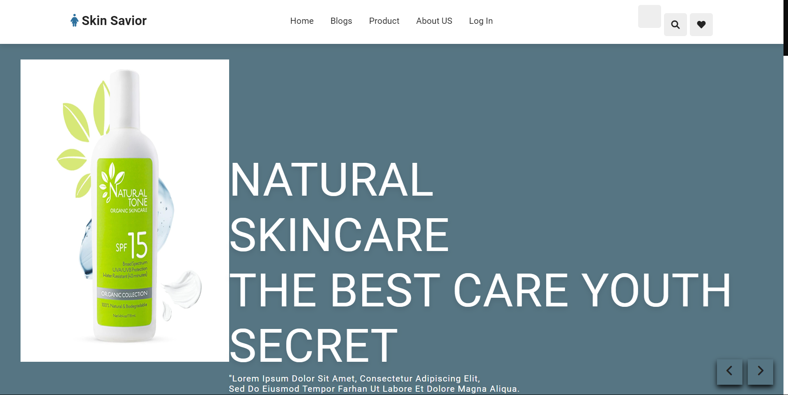

#Skin Care Web Application

Skin care application allows users to do CURD operation on product, reigster, log in, and admin to create blog post.
Application is development on Django framework.

##Function Requirement:
1. user can do CURD operation on product
2. user can login and signup
3. Admin can Create blog post

##Images of the website

